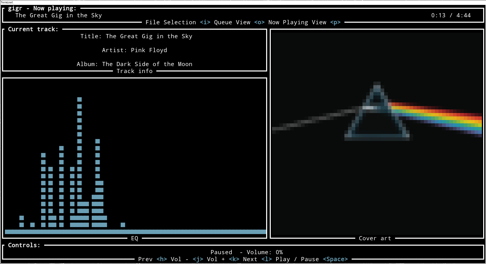

# gigr

```
         oo                   
                              
.d8888b. dP .d8888b. 88d888b. 
88'  `88 88 88'  `88 88'  `88 
88.  .88 88 88.  .88 88       
`8888P88 dP `8888P88 dP       
     .88         .88          
 d8888P      d8888P by mateiash
```

`gigr` is a command-line interface tool for playing music, written in Rust. It's simple, but development has not yet been completed :D! There are more features planned.

The program allows you to select directories and individual files from which to play supported audio in supported formats (`flac`, `wav` and `mp3`), adding them to a queue. If the directory of the currently playing song contains a file in `png` or `jpg` format, it will be displayed as album artwork.



### ⚠️ Important!
`gigr` is dependent on [ALSA](https://www.alsa-project.org/). For audio playback to function, you must install the respective packages for your system. (eg. if you are using Pipewire on Arch Linux, you must install `pipewire-alsa`)

## Features:
* Queue-based playback
* Album art display
* An EQ-like visualizer for viewing the frequencies of a song while it's playing
* Multiple modes
* Simple, keyboard exclusive controls
* Linux support

## Commands
### Basic playback
* `h` - jump to previous track
* `j` - volume down
* `k` - volume up
* `l` - skip track
* `space` - play/pause
### Mode switching
* `i` - File Selector Mode
* `o` - Queue View Mode
* `p` - Track Info Mode
* `q` - quit
### Navigation inside the File Selector Mode
* `a` - move to the parent directory
* `s` - move down
* `d` - move up
* `f` - move inside selected directory
* `Enter` - add files inside selected directory to the queue

## Building

This project is intended for use on GNU/Linux systems and can be built with Cargo.
To build, clone this repo, ensure you have Rust and Cargo installed, then run:

```
cargo build --release
```

Thanks to the testers!

[@Chimplement](https://github.com/Chimplement)
[@kettlemug](https://github.com/kettlemug)

And thank you too!